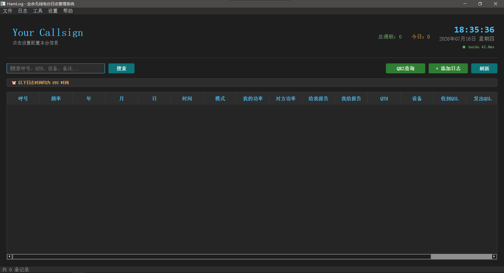

# HamLog 🎙️

[](https://www.gnu.org/licenses/gpl-3.0)
[](https://www.python.org/)
[](https://www.qt.io/)
[]()
[]()

> **一款为 HAM 打造的开源业余无线电台日志管理系统**

---

## 📖 简介

HamLog 是一款面向业余无线电爱好者（HAM）开发的本地电子日志管理软件，使用 **Python + PyQt6 + SQLite3** 构建，遵循 **GPL-3.0** 开源协议。

无论你是刚入门的爱好者还是资深火腿，HamLog 都能帮助你高效管理 QSO 日志、追踪 QSL 卡片收发状态。

---

## ✨ 功能特性

| 功能 | 状态 |
|------|------|
| 📝 **QSO 日志录入** | 支持呼号、频率、模式、功率、RST 报告等完整字段 |
| 🔍 **智能搜索** | 支持按呼号、QTH、设备、备注模糊搜索 |
| 📊 **实时统计** | 总通联数、今日通联数实时显示 |
| 🎴 **QSL 卡片管理** | 记录收发日期，追踪卡片状态 |
| ⚙️ **本台信息配置** | 呼号、姓名、QTH、网格定位等个性化设置 |
| 🌓 **深色/浅色主题** | 一键切换，适配不同使用环境 |
| 💾 **数据本地存储** | 所有数据保存在本地 SQLite 数据库，隐私安全 |
| 📤 **数据导出** | ADIF 格式导出 |

---

## 🖼️ 界面预览



*深色主题下的主界面，包含呼号信息栏、实时时钟、搜索工具和日志表格*

---

## 🚀 快速开始

### 环境要求

- **操作系统**：Windows 10 / 11 (x64)
- **Python**：3.7 或更高版本
- **依赖库**：PyQt6, SQLite3, subprocess,platform, pathlib, tempfile, urllib,  dataclasses, enum, typing

### 安装运行

```bash
# 克隆仓库
git clone https://github.com/ARPRC-BA8AQA/HamLog.git
cd HamLog

# 安装依赖
pip install PyQt6

# 运行程序
python "HAMLOG GUI.py"
```

### 打包为可执行文件

```bash
pip install pyinstaller
pyinstaller --onefile --windowed "HAMLOG GUI.py"
```

---

## 📁 项目结构

```
HamLog/
├── programs            #源码文件夹
  ├── version              #对应版本文件夹
    ├── HAMLOG GUI.py          # 主程序（PyQt6 GUI）
    ├── AutoDeal.py            # 后端模块（数据库、校验、设置管理）
    ├── Log.db                 # 本地 SQLite 数据库（运行时生成）
├── screenshots/           # 界面截图
├── LICENSE                # GPL-3.0 许可证
└── README.md              # 本文件
```

注意：每个版本的修改后的源码等都会被上传，他们在programs\version\下，这么做只是因为作者太懒了，懒得找修改源码的地方，这里还有各个版本的用户协议、打包安装包的iss文件和Readme文件。

---

## 🗄️ 数据库说明

HamLog 使用 **SQLite** 本地数据库，默认存储路径：

| 系统 | 路径 |
|------|------|
| Windows | `%APPDATA%\HamLog\Log.db` |
| macOS | `~/Library/Application Support/HamLog/Log.db` |
| Linux | `~/.local/share/HamLog/Log.db` |

> ⚠️ **建议定期备份 `Log.db` 文件，以防数据丢失！**

### 数据库字段

| 字段 | 说明 |
|------|------|
| `Callsign` | 对方呼号 |
| `Freq` | 频率 |
| `Year/Month/Day` | 通联日期 |
| `Time` | 通联时间 (HHMM) |
| `Mode` | 模式 (FM/SSB/CW/FT8 等) |
| `Power_self` | 我的功率 |
| `Power_side` | 对方功率 |
| `Rst_self` | 对方给我的报告 |
| `Rst_side` | 我给对方的报告 |
| `QTH` | 通联地点 |
| `Device` | 使用设备 |
| `QSL_RX` | 收到 QSL 日期 |
| `QSL_SEND` | 发出 QSL 日期 |
| `Remarks` | 备注 |

---

## 🤝 参与贡献

我们欢迎所有 HAM 和开发者的贡献！

### 如何贡献

1. **Fork** 本仓库
2. 个性化更改
3. 提交更改并推送至Dev分支
5. 打开 **Pull Request**

### 提交 Issue

发现 Bug 或有新功能建议？欢迎提交 [Issue](https://github.com/ARPRC-BA8AQA/HamLog/issues)！

---

## 📜 开源协议

本项目遵循 **[GNU General Public License v3.0](https://www.gnu.org/licenses/gpl-3.0)** 开源协议。

```
HamLog - 业余无线电台日志管理系统
Copyright (C) 2026  BA8AQA, BG5JQN 及所有贡献者

本程序是自由软件：你可以再发布本软件和/或修改本软件，
只要你遵守 GNU 通用公共许可证（GPL）第 3 版或（按你的决定）任何以后版本。

本程序是希望它能有用而发布的，但没有任何担保或
特定用途适用性的隐含担保；甚至没有适销性。详情请参阅 GNU 通用公共许可证。
```

---

## 🙏 致谢

特别感谢以下人员与组织对 HamLog 开发的支持：

- **BA8AQA** — 项目发起人与核心开发
- **BG5JQN** — 核心开发
- 所有提交 Issue 和 PR 的 HAM 朋友们
- 开源社区提供的优秀工具与库

---

## 📬 联系我们

| 平台 | 链接 |
|------|------|
| GitHub | [ARPRC-BA8AQA/HamLog](https://github.com/ARPRC-BA8AQA/HamLog) |
| Bilibili | [@C盘研究所-中国_BA8AQA](https://space.bilibili.com/1297822096?) |

---

<p align="center">
  <b>73 de BA8AQA & BG5JQN 🎙️</b><br>
  <i>愿电波永不消逝，友谊长存空中</i>
</p>
